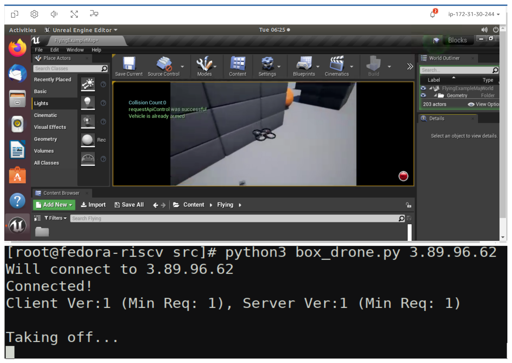

Summary
=========
This document provides installation instructions for deploying AirSim in an AWS environment. Nice DCV is used as a graphical session manager that supports hardware-accelerated rendering for the simulated graphics. Additionally this document explains how to create an AWS instance and install AirSim. Further airsim documentation can be found at https://microsoft.github.io/AirSim/.

   Fig. 1: Controlling AirSim from within a QEMU environment

Setup
======

* Setting up an AWS instance
    + Create an AWS account
    + Setup a login key for your account and download it onto your local machine
    + Ensure that you have an ssh client installed on your local machine
    + Navigate to the AWS EC2 Console: https://console.aws.amazon.com/ec2/v2/home?region=us-east-1 
    + Click “Launch Instances”
    + Under the “AWS Marketplace” tab, select the “Ubuntu 18.04 LTS Desktop - NICE DCV (GPU) with NVIDIA Gaming Drivers” image
    + For instance type, select a g4dn instance, preferably g4dn.2xlarge
    + Allocate an EBS volume of at least 200GB
    + For security, in addition to the default groups add a new rule for a TCP connection with port range 41451, with source 0.0.0.0/0
    + Launch the instance
* Using NICE DCV to connect to a graphical session
    + Use ssh to login to your instance
    + Use `sudo dcv list-sessions` to view any running sessions
    + Use `sudo dcv close-session [session name]` to close any running session
    + Run `sudo dcv create-session --type console airsim`
    + Note that a console session is chosen over a virtual session to avoid vulkan rendering issues
    + Create a user password by running `sudo passwd ubuntu`
    + Download and install the NICE DCV client for your local machine: https://download.nice-dcv.com/
    + Launch the DCV client and enter your instance’s IP address
    + Login with your root username and password
    + Login to the graphical session with ubuntu account.
* Install and test AirSim
    + Follow the instructions at https://microsoft.github.io/AirSim/build_linux/ for building Airsim on Linux
    + Set up python controller API
    + Install pip3 with `sudo apt install python3-pip`
    + `sudo pip3 install numpy`
    + `sudo pip3 install msgpack-rpc-python` 
    + `sudo pip3 install scikit-build`
    + `sudo pip3 install airsim`
* Running a simple flight controller
    + Follow the instructions at https://microsoft.github.io/AirSim/build_linux/ to load the example world, and start a simulation with a drone
    + Run `python3 [AirSim_Dir]/PythonClient/multirotor/hello_drone.py`
    + Follow the prompts and watch the drone fly!

