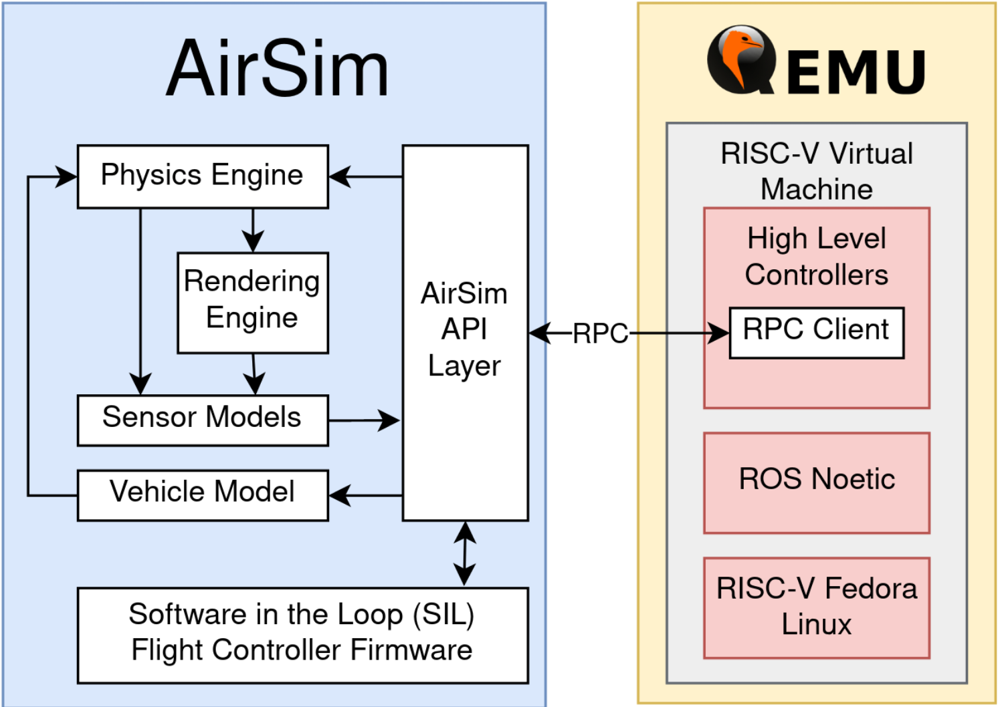

Introduction
==========

A fruit fly can compute workloads including trajectory planning,
visual/inertial odometry (VIO), classification, and closed-loop control,
all while only consuming 120 nW [1]. A
state-of-the-art VIO ASIC consumes 2 mW [2]---over
10,000 times more power. With such a stark difference, biology
suggests vast optimization opportunities for autonomous systems.
However, closing the gap becomes increasingly challenging; with the end
of Moore's Law and Dennard Scaling, it is no longer feasible to rely on
process technology improvements and general purpose processors (GPPs) to
improve power efficiency and performance [3]. As a
result, over the past decade there has been a proliferation of academic
research groups, startups, and industrial R&D labs developing domain
specific accelerators (DSAs) to eke out remaining performance
improvements. Although DSAs can offer orders of magnitude improved
performance over GPPs on isolated robotics benchmarks, factors such as
diminishing returns of acceleration due to Amdahl's Law, poor functional
unit utilization, contention over shared resources in heterogeneous
systems, and unsupported computational kernels limit acceleration at a
system-level. These issues are exacerbated in autonomous robotics
systems, which face strict power, latency, and quality of service (QoS)
constraints. These challenges present opportunities to improve robotics
DSA performance by making use of hardware-software co-design techniques
coupled with the full-stack evaluation of robotics SoC designs.

There are numerous projects using specialized hardware to accelerate a
variety of robotics tasks[2]，[4]-[9] However, integrating and evaluating the performance of such hardware
accelerators at a system level remains challenging. While the latency
and throughput characteristics of robotics DSAs can be evaluated using
data traces generated by model-based simulations, such methodologies to
not capture system level feedback loops between hardware acceleration
and robot behavior. For example, prior work has shown that in
hardware-in-the-loop (HIL) setups, scaling clock frequency and
allocating more compute units can directly impact quality-of-flight
metrics in a quadrotor, such as flight velocity
[10]. Conversely, higher velocity can negatively
impact pose estimation accuracy [11], impacting trajectory
planning and optimal control workloads which make use of iterative
algorithms with variable runtimes. Therefore, a closed-loop test setup
is needed for evaluating hardware accelerators for robotics. For designs
implemented on programmable hardware such as GPUs and FPGAs, closed-loop
evaluation is possible using hardware-in-the-loop (HIL) setups. However,
this cannot be done with ASIC designs unless the chip is manufactured,
which is a very expensive and time consuming task. Because of this, in
order perform pre-silicon performance evaluation of a robotics SoC it is
necessary to co-simulate the architectural behavior of hardware running
a full robotics software stack together with a robotics environment
modeling system dynamics and sensor data.

Related Work
============

Co-Simulation of Custom SoC Hardware
------------------------------------

The co-simulation infrastructure presented in this paper builds upon
prior projects, integrating various functionality to support a full
stack robotics co-simulation infrastructure. To begin, this project
heavily depends on the RTL simulation and synchronization functionality
functionality provided by FireSim [14]. FireSim already has
built-in synchronization support, used to provide deterministic behavior
both between FPGA targets, and FPGA targets and hosts. However, the
functionality that this project needs to build on top of FireSim is the
ability to have deterministic transactions that are initiated by the
host, as typically FireSim bridges are configured to be deterministic
with respect to transactions initiated by a target device. Additionally,
while co-simulation projects have been built using FireSim, such as the
Fromajo project, they differ in scope from this co-simulator. Fromajo is
used to validate FireSim simulations against the Dromajo [19]
architectural simulator [16]. Fromajo differs from this
co-simulation infrastructure, however, as it is meant to be a platform
for verification, and compares two instruction traces rather than
integrating two simulators to support closed-loop feedback.

Simulation-Based Design Space Exploration of UAV Hardware
---------------------------------------------------------

Several projects have used simulation methods to evaluate the impact of
custom hardware on the flight performance of UAVs. One significant work
presents MAVBench[10], a closed-loop
benchmarking suite based on AirSim. MAVBench profiled several UAV
workloads such as scanning, package delivery, and 3D mapping in a HIL
environment, running flight controller code on a Pixhawk board, and
running high level control code on an NVIDIA Jetson TX2. While the
benchmark did not explore custom robotics architectures, the authors
determined that hardware accleration could affect quality-of-flight
metrics such as maximum drone velocity, and total mission time. The
hardware acceleration explored included sweeps of the SoCs' clock speed,
as well as the number of cores allocated for robotics workloads.

Closed-Loop Simulation of Custom Robotics Hardware and Systems
--------------------------------------------------------------

Another work that is relevant to this project is a prior co-simulation
infrastructure developed at Linköping University [20].
This project functions as a HIL setup, co-simulating an FPGA running
robotics workloads with the Wolfram SystemModeler simulation environment
[21]. An FPGA and host computer are
connected using a serial interface for synchronization and data
transfer. This project differs from prior FPGA prototyping attempts as
it synchronizes FPGA cycles to match SystemModeler's update rate,
whereas prototyping projects run all systems directly in real-time.
However, this project lacks several features compared to the proposed
co-simulation infrastructure. First, rather than using a true
cycle-exact ASIC simulation, the HIL co-simulator synchronizes against
an FPGA implementation, which has different performance characteristics
compared to an ASIC [14]. Secondly, the HIL co-simulator currently
only supports low-level hardware accelerators instead of an entire SoC
supporting a full Linux stack. Having full-stack support is important
for supporting and integrating projects that make use of the modern
open-source robotics ecosystem. Finally, this paper's co-simulation
infrastructure intends to support the ROS framework, allowing for a more
standardized approach for integrating robotic software components.

Finally, there have been prior attempts at co-simulating robotics
simulations on top of the Gazebo/ROS ecosystem. One such project,
CORNET, presents middleware that integrates a Gazebo simulation with a
multiple UAV flight controllers [22]. As in this
project, CORNET uses a custom Gazebo plugin to perform synchronization
with external simulators. However, CORNET is intended to provide
co-simulation between Gazebo and a network simulator instead of
cycle-exact hardware simulation, and so it has vastly different timing
and performance requirements compared to this co-simulation
infrastructure.

Based on this review, there have been many projects that support
elements of the infrastructure needed for closed-loop robotics ASIC
co-simulation. However, this project is novel as it integrates all these
aspects into one system.

Design
===================

In this project we develop co-simulation infrastructure to enable
the design space exploration of robotics SoCs. As a driving application,
we look at autonomous quadrotor systems. This is because UAVs make
for an interesting design point due to the interactions between latency,
power, and weight constraints [12], as well as the fact
that the SoCs used onboard UAVs are comparable in scale to those
previously designed at the ADEPT Lab at UC Berkeley.

In our project we focus on simulating a drone's hardware and software
stack, along with a physical design to be used as a reference
implementation. We implemented a design that implements the computers,
actuators, and sensors as depicted in
Figure [1]. In this configuration, we have
both the flight controller and companion computer on-board the drone, as
this design point has more interesting constraints for the companion
computer SoC. We use ASPLOS21-Drone for physical prototyping drone in this project, which is an
open source drone released with detailed assembly documentation
[12]. In addition to the hardware, a preliminary draft
of the software stack we plan on running on both the flight controller
and companion computer is depicted in Figure [3].

.. figure:: ./images/Hardware\ Architecture.png
   :scale: 20 %
   :alt: Figure 3

   Fig. 1: Electronics top level diagram for the proposed UAV.

.. figure:: ./images/High\ Level\ Control.png
   :scale: 20 %
   :alt: Figure 3

   Fig. 2: An example software stack for both the flight controller and the companion computer.

.. figure:: ./images/Flight\ Control.png
   :scale: 20 %
   :alt: Figure 3

   Fig. 2: An example software stack for both the flight controller and the companion computer.

Secondly, a key component of our work involves developing the
co-simulation infrastructure for our UAV. Our work builds upon two
existing simulators. For simulating UAV dynamics and visual rendering we
plan on use the AirSim simulator
, based on Unreal Engine developed by Microsoft [13]. For
cycle-accurate SoC simulation, we use
FireSim, an FPGA-accelerated RTL simulator developed
at the ADEPT Lab at UC Berkeley. A top level diagram of our
infrastructure is depicted in Figure [5], with components that we expect to make
major modifications to highlighted in red. These components mainly
consist of the target-to-host bridges found in FireSim, which are
responsible for the communication and synchronization between the host
CPU managing the RTL simulation, and the target FPGA accelerating the
simulation. Our modifications will synchronize the clock cycles
elapsed in the RTL simulation with the amount of time simulated in
AirSim, as well as to schedule the data transfers between AirSim and the
SoC I/O modeled by FireSim. Before moving robotics software to the
FireSim simulations, we evaluate the RISC-V ports in a QEMU session
as depicted in Figure [4].

   Fig. 3: Top level architecture for evaluating ROS workloads on the RISC-V software stack.

   Fig. 4: Top level architecture for the proposed co-simulation architecture

The final component of our project involves generating SoC instances
on which we evaluate our software stack. For our project, we
focus on evaluating custom hardware for an on-board companion computer.
This is because the flight controller can be implemented using a
low-power microcontroller, and provides no benefit from being
accelerated as the frequency of the flight controller loop is bounded by
the physical properties of an UAV rather than by the available compute
capabilities [12]. On the other hand, accelerating high
level control tasks in a HIL setup has been shown to improve
quality-of-flight metrics in quadrotors, such as mission time and
maximum velocity [10]. Because these high level
control tasks run on the companion computer, we identified this unit for
our design-space exploration. Developing new custom hardware
accelerators is out of the scope of this project. However, we will still work on evaluating configurations of existing hardware, including the
in-order Rocket CPU [15], the out-of-order superscalar
BOOM CPU [16], and Gemmini, a systolic array hardware
generator [17]. We generate hardware designs
using these components using Chipyard, an SoC generator developed by the
ADEPT Lab at UC Berkeley [18]. While discovering an optimal SoC
configuration is out of the scope of this project, we use the
designs to evaluate the co-simulation infrastructure.

The project incorporates sensing and actuation through the use
of the ASPLOS21-Drone, which acts as a physical reference design for
the co-simulation infrastructure. However, sensing and actuation have also 
be explored through the simulated environment. Similarly, high
level control and planning algorithms will be deployed on both the
physical and simulated drones.

Physical Drone Implementation
==============================

The design was built from commercially avalable parts, and assembled by the team. The overall design is based off of the ASPLOS21-Drone, which provided a build guide and a starting point for reference software. However, the ASPLOS21-Drone did not come with a bill of materials, so some adjustments were made to the construction of the drone compared to the paper. Additionally, to support some of the features needed for indoor flight, several changes had to be made to the software implementation on board the drone.

Bill of Materials
-------------------

A representation of all the parts needed for the drone are depicted in Figure [5]

   Fig. 5: A breakdown of all parts used to build the drone. From the top left corner going clockwise: F450 Frame, Motors, Propellers, Raspicam, Raspberry Pi 4 B, 3C LiPo Battery, Navio2, GPS, ESC, RC Unit, PPM Encoder

.. tabularcolums:: |p{1cm}|p{7cm}|p{5cm}|p{1cm}|

.. csv-table:: Bill of Materials 
   :file: parts.csv
   :header-rows: 1
   :class: longtable
   :widths: 1 1

+---------------------+----------+--------+----------+
+ Component           +  Price   + Vendor +	Quantity +
+=====================+==========+========+==========+
+ F450  Frame	      +  21.99	 + Amazon +	1        +
+---------------------+----------+--------+----------+
+ Motors	          +  38.99	 + Amazon +	1        +
+---------------------+----------+--------+----------+
+ Propellers	      +  12.99	 + Amazon +	1        +
+---------------------+----------+--------+----------+
+ Camera	          +  18.99	 + Amazon +	1        +
+---------------------+----------+--------+----------+
+ Onboard Computer	  +  119.99	 + Amazon +	1        +
+---------------------+----------+--------+----------+
+ Flight Controller	  +  205.00	 + Navio2 +	1        +
+---------------------+----------+--------+----------+
+ Speed Controller	  +  39.99	 + Amazon +	1        +
+---------------------+----------+--------+----------+
+ Radio System	      +  47.99	 + Amazon +	1        +
+---------------------+----------+--------+----------+
+ Encoder	          +  13.89	 + Amazon +	1        +
+---------------------+----------+--------+----------+
+ Battery	          +  26.99	 + Amazon +	1        +
+---------------------+----------+--------+----------+
+ Adhesive	          +  10.99	 + Amazon +	1        +
+---------------------+----------+--------+----------+
+ Total	              +  557.80	 +        +          +
+---------------------+----------+--------+----------+
	

Assembly and Bringup
-------------------
The drone (named Baby Bird) was assembled following instructions in the BuildGuide of the ASPLOS21-Drone, found `here <https://github.com/ramyadhadidi/ASPLOS21-Drone/blob/main/BuildGuide/Build-Guide.pdf>`_.

Changes compared to the buildguide was the fact that A Raspberry Pi 4 was used instead of a Raspberry Pi 3, the ESCs had built-in bullet connectors, and that a Raspicam was attached to enable vision.

After assembly, the Baby Bird should look as depicted in Figure [6].

.. figure:: ./images/drone_final.jpg
   :scale: 10 %
   :alt: Figure 6

   Fig. 6: A top view of Baby Bird, with the battery disconnected and powered off.

Additionally, to build the software infrastructure needed to fly the drone, it is necessary to install Emlid OS, which can be downloaded `here <https://docs.emlid.com/navio2/configuring-raspberry-pi/>`_.

ROS Infrastructure
------------------------

ROS is already pre-installed on EmlidOS, but additional ROS libraries need to be installed as needed using the scripts provided at the Navio2 github repository, `here <https://github.com/emlid/Navio2/A>`_. Additionally, the custom ROS code needed to run the project can be found `here <https://github.com/CobbledSteel/eecs206a-proj-software>`_.

At a high level, the software used in this project interfaces with the system as shown in Figure [7]. The low level control is handled through the flight controller, `ArduPilot`, while the high level control is handled through `mavros`, which in turn can connect with other ROS nodes, such as those that handle pose estimation. `mavros` also directly reads camera data from a ROS topic, while IMU data is read by `ArduPilot`, which also drives the `ESCs`. Finally the system can be controlled through the RC unit using MAVLink, or through the ground control station. In this case, `mavros` also acts as a MAVLink bridge to the ground control station.

   Fig. 7: A system level diagram of the ROS nodes interfacing with the system.

A diagram of the TF tree generated by the ROS nodes is depicted in Figure [8], while the ROS graph is depicted in Figure [9]. 

   Fig. 8: The `rqt_tree` graph showing how the camera frame is connected to the world frame.

   Fig. 9: The `rqt_tree` graph showing how the camera frame is connected to the world frame.

Configuration and Software
---------------------------
To support the newer extended kalman filter options of ArduPilot, it is necessary to build an updated version of ArduPilot from source. To do th is, one can follow the documentation `here <https://docs.emlid.com/navio2/ardupilot/building-from-sources>`_, using branch `Copter-4.1.1`. Additionally, one must point `/etc/systemd/system/arducopter.service` to the updated binary. To setup mavlink and mavros with the right IPs and ports, one can then follow the instructions `here <https://docs.emlid.com/navio2/ros/>`_.

Next, one needs to run all of the ROS nodes to connect to the ground control station. to do this, one can run the following instructions in separate terminals:

* `roslaunch mavros apm.launch`
* `cd eecs206a-proj-software && source devel/setup.bash && roslaunch raspicam_node camera_640x480_raw.launch`
* `roslaunch apriltag_ros drone_continuous.launch`
* `rosrun tf static_transform_publisher 0 0 0 0 0 0 tag_0 map 100`
* `cd eecs206a-proj-software && source devel/setup.bash && rosrun drone_test publish_vision_pose.py`

The output should look as depicted in Figure [10].

   Fig. 10: All necessary ROS nodes running in separate terminal sessions (using tmux).

If this is functional, one can then connect to the drone using a ground control station such as Mission Planner, found `here <https://ardupilot.org/planner/docs/mission-planner-installation.html>`_. Once th is is installed, one needs to set the following parameters to set vision based positioning to be the default system. This way only vision is used, without a GPS, which is suitable for indoor flight.

* EK3_SRC1_POSXY = 0 (No primary horizontal position)
* EK3_SRC1_VELXY = 0 (No primary horizontal velocity)
* EK3_SRC1_POSZ = 1 (Primary vertical position from barometer)
* EK3_SRC1_VELZ = 0 (No vertical velocity)
* EK3_SRC1_YAW = 1 (Primary yaw/heading from compass)
* EK3_SRC2_POSXY = 6 (Secondary horizontal position from External Nav)
* EK3_SRC2_VELXY = 6 (Secondary horizontal velocity from External Nav)
* EK3_SRC2_POSZ = 1 (Secondary vertical position from barometer)
* EK3_SRC2_VELZ = 6 (Secondary vertical velocity from External Nav)
* EK3_SRC2_YAW = 6 (Secondary yaw/heading from External Nav)

Alternatively, all software can be set up from the pre-built image found `here <https://drive.google.com/file/d/1SMRmIbvDc8y0SAXKeIau17e4_GMBGMAR/view?usp=sharing>`_. This just needs to be flashed onto an SD card with the Raspberry Pi.

Co-Simulation Implementation
==============================
At a high level the end-goal of the co-simulation infrastructure is to run and integrate both the AirSim and FireSim simulators. For practical purposes, these are deployed on different machines, one running Ubuntu 18.04 for AirSim, and the other running Centos for FireSim. The system can be viewed as in Figure [11]. In this case, AirSim runs on a `g4dn.2xlarge` instance of AWS, and the FireSim manager runs on a `c5.4xlarge` instance while the FireSim target simulator runs on a `f1.2xlarge` instance.

   Fig. 11: High-level co-simulation deployment

Installing and Deploying AirSim
----------------------------------

* Setting up an AWS instance
    + Create an AWS account
    + Setup a login key for your account and download it onto your local machine
    + Ensure that you have an ssh client installed on your local machine
    + Navigate to the AWS EC2 Console: https://console.aws.amazon.com/ec2/v2/home?region=us-east-1 
    + Click “Launch Instances”
    + Under the “AWS Marketplace” tab, select the “Ubuntu 18.04 LTS Desktop - NICE DCV (GPU) with NVIDIA Gaming Drivers” image
    + For instance type, select a g4dn instance, preferably g4dn.2xlarge
    + Allocate an EBS volume of at least 200GB
    + For security, in addition to the default groups add a new rule for a TCP connection with port range 41451, with source 0.0.0.0/0
    + Launch the instance
* Using NICE DCV to connect to a graphical session
    + Use ssh to login to your instance
    + Use `sudo dcv list-sessions` to view any running sessions
    + Use `sudo dcv close-session [session name]` to close any running session
    + Run `sudo dcv create-session --type console airsim`
    + Note that a console session is chosen over a virtual session to avoid vulkan rendering issues
    + Create a user password by running `sudo passwd ubuntu`
    + Download and install the NICE DCV client for your local machine: https://download.nice-dcv.com/
    + Launch the DCV client and enter your instance’s IP address
    + Login with your root username and password
    + Login to the graphical session with ubuntu account.
* Install and test AirSim
    + Follow the instructions at https://microsoft.github.io/AirSim/build_linux/ for building Airsim on Linux
    + Set up python controller API
    + Install pip3 with `sudo apt install python3-pip`
    + `sudo pip3 install numpy`
    + `sudo pip3 install msgpack-rpc-python` 
    + `sudo pip3 install scikit-build`
    + `sudo pip3 install airsim`
* Running a simple flight controller
    + Follow the instructions at https://microsoft.github.io/AirSim/build_linux/ to load the example world, and start a simulation with a drone
    + Run `python3 [AirSim_Dir]/PythonClient/multirotor/hello_drone.py`
    + Follow the prompts and watch the drone fly!

Deploying the AirSim Client in QEMU
--------------------------------------
First, one must launch a Fedora QEMU RISC-V image using FireMarshal, using documentation found `here  <https://firemarshal.readthedocs.io/en/stable/Tutorials/custom.html#fedora-based>`_. Once the virtual machine is launched, one can interactively install the depenencies for AirSim:

* `sudo apt install python3-pip`
* `sudo pip3 install numpy`
* `sudo pip3 install msgpack-rpc-python`
* `sudo pip3 install scikit-build`
* `sudo pip3 install --no-deps airsim`

Once this is done, one can clone the project repository `here <https://github.com/CobbledSteel/eecs206a-proj-software/blob/master/src/basic_tests/src/box_drone.py>`_ and run the `box_drone.py` program from within the QEMU session, passing in the AirSim IP as an argument. A co-simulation is now running with AirSim and QEMU.

Deploying the AirSim Client in FireSim
----------------------------------------
This step is still a work in progress, and the features are not fully supported. To do this, one must follow the instructions found `here <https://docs.fires.im/en/latest/Advanced-Usage/Miscellaneous-Tips.html#experimental-support-for-sshing-into-[…]-the-internet-from-within-simulations>`_ and deploy the image generated by FireMarshal from the previous step. Now, one can run AirSim with FireSim, simulating AirSim with a RISC-V SoC modeled in FireSim.

Tasks, Milestones, and Assessment
=================================

This project includes a broad range of tasks, and relies heavily on
infrastructure development. Accounting for this, we have not accomplish every task, given that there might be unexpected issues
related with third-party components. We divide the tasks into Base,
Target, and Reach, where we completed base tasks by mid November,
Target tasks by the project deadline, and Reach tasks if time permits.
As this is a continuing research project, we plan on continuing this
infrastructure development after the semester ends.

We will assess the success of this project both on the milestones met,
but also by the documentation and analysis of areas of improvement in
the robotics, open source hardware, and electronic design automation
communities that we encounter while working on this project.

Physical UAV Prototyping
------------------------

-   **(Base) Obtain FAA licenses and register drone:** Needed to legally
    pilot drones for recreational/research purposes. Can be filed
    online.

-   **(Base) Assemble ASPLOS21-Drone:** Purchase the parts listed in the
    BOM and follow the assembly instructions as in the ASPLOS21-Drone
    BuildGuide. Ensure that the drone functions using manual controls.

-   **(Base) Deploy flight controller:** Deploy ArduPilot onto the drone
    hardware, and verify that it can perform takeoff/landing as well as
    waypoint tracking.

-   **(Target) Develop basic high level control in ROS:** Deploy
    algorithms including mapping, localization, perception, and
    trajectory planning.

-   **(Reach) Evaluate UAV performance:** Verify that the system
    displays expected functionality, and note potential improvements.

-   **(Reach) Optimize high level control in ROS:** Make improvements to
    algorithms and scheduling to improve system-level performance.

Porting ROS libraries to RISC-V
-------------------------------

-   **(Base) Port core ROS middleware:** Ensure that core ROS libraries
    are functional when compiled for RISC-V, demonstrating functionality
    of a ROS master as well as `roscpp` or `rospy`.

-   **(Target) Port integration-level libraries:** Ensure that standard
    or commonly used libraries such as `sensor_msgs`, `geometry_msgs`
    and `tf2` function properly.

-   **(Reach) Port application-level libraries:** Build and verify the
    functionality of libraries such as MoveIt, gmapping, and OpenCV.

Developing Co-simulation Infrastructure
---------------------------------------

-   **(Base) Interface with AirSim from QEMU session:** Transmit
    waypoints to AirSim from a RISC-V QEMU session, and receive sensor
    data through the AirSim APIs.

-   **(Target) Integrate ROS in QEMU with AirSim:** Run ROS code ported
    to RISC-V running high-level control, deploying setpoints to and
    reading sensor data from AirSim.

-   **(Target) Interface with AirSim from FireSim:** Transmit waypoints
    to and receive sensor data from AirSim from a simulated SoC within
    FireSim.

-   **(Reach) Integrate ROS on FireSim with AirSim:** Run ROS code on
    FireSim, communicating with AirSim.

-   **(Reach) Implement lockstep time synchronization between AirSim and
    FireSim:** Create a synchronizer bridge between FireSim and Airsim,
    using custom hardware to ensure lockstep synchronization between
    AirSim frames and FireSim cycles.

-   **(Reach) Implement deterministic data synchronization between
    Airsim and FireSim:** Implement a system for scheduling and
    releasing data transfers at deterministic time intervals between
    AirSim and FireSim, stalling simulation in case of unexpected
    network delays.

Generating Robotics SoC Designs in Chipyard
-------------------------------------------

-   **(Base) Single Rocket Core:** Generate hardware using a single
    Rocket in-order CPU.

-   **(Target) Multi-core Rocket:** Generate hardware with 4-8 Rocket
    cores.

-   **(Target) Single BOOM Core:** Generate hardware using a BOOM
    out-of-order superscalar CPU.

-   **(Reach) Heterogeneous Rocket/BOOM SoC:** Generate design with both
    high performance BOOM cores and efficient Rocket cores.

Documenting Challenges
----------------------

-   **Software Challenges:** Did any of the software/algorithms not work
    as expected? Are there any potential improvements?

-   **Software Infrastructure Challenges:** Are there any missing
    libraries or tools that prevent porting some software libraries to
    RISC-V? Are there deficiencies with simulators impacting integration
    for co-simulation?

-   **Hardware Challenges:** Do existing configurations face significant
    bottlenecks for the given workloads?

-   **Hardware Infrastructure Challenges:** Are there missing
    features/IP that impact the ability to port applications to RISC-V?
    Are there limitations of FPGA-accelerated simulations that impact
    co-simulation performance?

-   **Unexpected Issues:** Any other legal/social/mechanical/etc.
    concerns?

Items for physical prototyping
------------------

We use the ASPLOS21-Drone to perform physical prototyping for
this project. This project involves purchasing components for physical
prototyping, as well as paying for the use of AWS infrastructure for
software development and running GPU and FPGA accelerated simulations.
Additionally, we also use the following AWS EC2 instances using on-demand pricing: `c5.4xlarge`
(Managing FireSim simulations, general software development),
`g4dn.2xlarge` (Running GPU-accelerated drone simulations using AirSim),
and `f1.2xlarge` (Running FPGA-accelerated RTL simulations in FireSim.)
Funding for purchasing components will be provided by grants through the
ADEPT Lab.

Results
============

.. raw:: html

    <video width="320" height="240" controls><source src="./videos/BabyBird.mp4" type="video/mp4">Your browser does not support the video tag.</video>

Conclusion
============

Team 
=================

Dima Nikiforov
--------------

Dima is in charge of tasks involving porting software libraries to
RISC-V, developing FireSim to support co-simulation, and generating
hardware designs, given their experience working with similar
infrastructures and environments at the ADEPT Lab.

Chris Dong
----------

Chris is in charge of developing the software infrastructure via ROS and AirSim,
setting up AirSim in AWS server and running built-in simple flight
controller, along with developing and testing high level algorithms both
in simulation and on the real drone.

Collaboration
-------------

While we plan on collaborating throughout the project, we will make sure
to only do drone hardware prototyping and testing when both group
members are present in order to follow lab safety protocols. We will
also collaborate heavily to ensure that we can successfully integrate
the infrastructure components that we develop.

Additional Materials
=====================

References
============
[1] L. K. Scheffer, “The physical design of biological systems-insights from
the fly brain,” in Proceedings of the 2021 International Symposium on
Physical Design, 2021, pp. 101–108.

[2] A. Suleiman, Z. Zhang, L. Carlone, S. Karaman, and V. Sze, “Navion:
A 2-mw fully integrated real-time visual-inertial odometry accelerator
for autonomous navigation of nano drones,” IEEE Journal of Solid-State
Circuits, vol. 54, no. 4, pp. 1106–1119, 2019.

[3] J. L. Hennessy and D. A. Patterson, “A new golden age for computer
architecture,” Communications of the ACM, vol. 62, no. 2, pp. 48–60,
2019.

[4] Z. Wan, B. Yu, T. Y. Li, J. Tang, Y. Zhu, Y. Wang, A. Raychowdhury,
and S. Liu, “A survey of fpga-based robotic computing,” 2021.

[5] R. Li, X. Huang, S. Tian, R. Hu, D. He, and Q. Gu, “Fpga-based
design and implementation of real-time robot motion planning,” in 2019
9th International Conference on Information Science and Technology
(ICIST). IEEE, 2019, pp. 216–221.

[6] B. Chr ́etien, A. Escande, and A. Kheddar, “Gpu robot motion planning
using semi-infinite nonlinear programming,” IEEE Transactions on
Parallel and Distributed Systems, vol. 27, no. 10, pp. 2926–2939, 2016.

[7] J. Liang, V. Makoviychuk, A. Handa, N. Chentanez, M. Macklin, and
D. Fox, “Gpu-accelerated robotic simulation for distributed reinforce-
ment learning,” in Conference on Robot Learning. PMLR, 2018, pp.
270–282.

[8] S. Murray, W. Floyd-Jones, Y. Qi, G. Konidaris, and D. J. Sorin, “The
microarchitecture of a real-time robot motion planning accelerator,” in
2016 49th Annual IEEE/ACM International Symposium on Microarchi-
tecture (MICRO). IEEE, 2016, pp. 1–12.

[9] S. Lian, Y. Han, X. Chen, Y. Wang, and H. Xiao, “Dadu-p: A scalable
accelerator for robot motion planning in a dynamic environment,” in
2018 55th ACM/ESDA/IEEE Design Automation Conference (DAC).
IEEE, 2018, pp. 1–6

[10] B. Boroujerdian, H. Genc, S. Krishnan, W. Cui, A. Faust, and V. Reddi,
“Mavbench: Micro aerial vehicle benchmarking,” in 2018 51st Annual
IEEE/ACM International Symposium on Microarchitecture (MICRO).
IEEE, 2018, pp. 894–907.

[11] J. Delmerico, T. Cieslewski, H. Rebecq, M. Faessler, and D. Scaramuzza,
“Are we ready for autonomous drone racing? the uzh-fpv drone racing
dataset,” in 2019 International Conference on Robotics and Automation
(ICRA). IEEE, 2019, pp. 6713–6719.

[12] R. Hadidi, B. Asgari, S. Jijina, A. Amyette, N. Shoghi, and
H. Kim, “Quantifying the design-space tradeoffs in autonomous
drones,” in Proceedings of the 26th ACM International Conference
on Architectural Support for Programming Languages and Operating
Systems, ser. ASPLOS 2021. New York, NY, USA: Association
for Computing Machinery, 2021, p. 661–673. [Online]. Available:
https://doi.org/10.1145/3445814.3446721

[13] S. Shah, D. Dey, C. Lovett, and A. Kapoor, “Airsim: High-fidelity visual
and physical simulation for autonomous vehicles,” in Field and service
robotics. Springer, 2018, pp. 621–635.

[14] S. Karandikar, H. Mao, D. Kim, D. Biancolin, A. Amid, D. Lee,
N. Pemberton, E. Amaro, C. Schmidt, A. Chopra, Q. Huang, K. Kovacs,
B. Nikolic, R. Katz, J. Bachrach, and K. Asanovic, “Firesim: Fpga-
accelerated cycle-exact scale-out system simulation in the public cloud,”
in 2018 ACM/IEEE 45th Annual International Symposium on Computer
Architecture (ISCA), 2018, pp. 29–42.

[15] K. Asanovic, R. Avizienis, J. Bachrach, S. Beamer, D. Biancolin,
C. Celio, H. Cook, D. Dabbelt, J. Hauser, A. Izraelevitz et al., “The
rocket chip generator,” EECS Department, University of California,
Berkeley, Tech. Rep. UCB/EECS-2016-17, 2016.

[16] J. Zhao, B. Korpan, A. Gonzalez, and K. Asanovic, “Sonicboom: The
3rd generation berkeley out-of-order machine,” in Fourth Workshop on
Computer Architecture Research with RISC-V, 2020.

[17] H. Genc, S. Kim, A. Amid, A. Haj-Ali, V. Iyer, P. Prakash, J. Zhao,
D. Grubb, H. Liew, H. Mao et al., “Gemmini: Enabling systematic deep-
learning architecture evaluation via full-stack integration,” in Proceed-
ings of the 58th Annual Design Automation Conference (DAC), 2021.

[18] A. Amid, D. Biancolin, A. Gonzalez, D. Grubb, S. Karandikar, H. Liew,
A. Magyar, H. Mao, A. Ou, N. Pemberton, P. Rigge, C. Schmidt,
J. Wright, J. Zhao, Y. S. Shao, K. Asanovi ́c, and B. Nikoli ́c, “Chipyard:
Integrated design, simulation, and implementation framework for custom
socs,” IEEE Micro, vol. 40, no. 4, pp. 10–21, 2020.

[19] “Dromajo,” 2021. [Online]. Available: https://github.com/chipsalliance/
dromajo

[20] M. Acevedo, “Fpga-based hardware-in-the-loop co-simulator platform
for systemmodeler,” 2016.

[21] K. Rozhdestvensky, V. Ryzhov, T. Fedorova, K. Safronov, N. Tryaskin,
S. A. Sulaiman, M. Ovinis, and S. Hassan, “Description of the wolfram
systemmodeler,” in Computer Modeling and Simulation of Dynamic
Systems Using Wolfram SystemModeler. Springer, 2020, pp. 23–87.

[22] S. Acharya, A. Bharadwaj, Y. Simmhan, A. Gopalan, P. Parag, and
H. Tyagi, “Cornet: A co-simulation middleware for robot networks,”
in 2020 International Conference on COMmunication Systems & NET-
workS (COMSNETS). IEEE, 2020, pp. 245–251.
